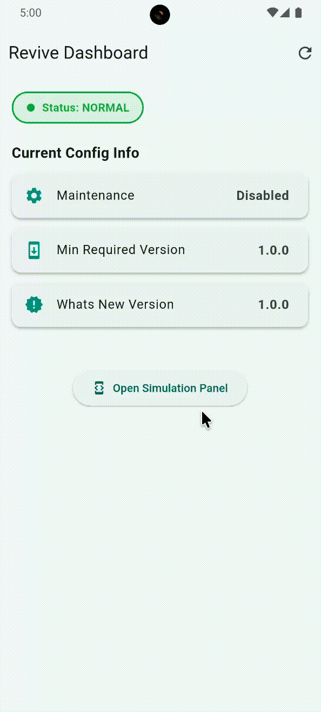

# GroundControl 🚀

**One widget. Your whole app, handled.** 

---

## 📸 Previews

| No Internet | Maintenance Mode | Force Update |
| :---: | :---: | :---: |
|  |  |  |

---

GroundControl is a production-ready Flutter package that wraps your entire application in a single `GroundControlShell` widget. It automatically manages:

## Features

- 📶 **No Internet Detection**: Full-screen blocking UI with auto-retry.
- 🛠 **Maintenance Mode**: Remote-controlled downtime screens with estimated return times.
- 🔄 **Force Updates**: Mandatory version enforcement with direct app store links.
- ✨ **What's New**: Gorgeous, version-tracked changelog popups for your users.

All logic is driven by a single remote JSON configuration, allowing you to control your app's state without a single code change.

---

## Installation

Add `ground_control` to your `pubspec.yaml`:

```yaml
dependencies:
  ground_control: ^1.0.0
```

## Quick Start

Wrap your `MaterialApp` with `GroundControlShell` at the root of your app:

```dart
import 'package:ground_control/ground_control.dart';

void main() {
  runApp(
    GroundControlShell(
      configUrl: 'https://your-server.com/ground_control_config.json',
      appVersion: '1.5.0', // Your current app version
      child: MaterialApp(
        home: MyHomePage(),
      ),
    ),
  );
}
```

---

## Remote JSON Structure

Host a JSON file at your `configUrl` with the following structure:

```json
{
  "maintenance": {
    "enabled": false,
    "title": "Quick Maintenance",
    "message": "We'll be back in a few minutes!",
    "estimated_end": "2026-05-01T14:00:00Z"
  },
  "force_update": {
    "enabled": true,
    "min_version": "2.0.0",
    "title": "Update Required",
    "message": "Please update to the latest version to continue.",
    "store_url_android": "https://play.google.com/store/apps/details?id=your.package",
    "store_url_ios": "https://apps.apple.com/app/id123456789"
  },
  "whats_new": {
    "enabled": true,
    "version": "2.1.0",
    "title": "Version 2.1 is here!",
    "items": [
      {
        "emoji": "🎨",
        "title": "New Dark Mode",
        "description": "A beautiful new dark theme for your eyes."
      },
      {
        "emoji": "🚀",
        "title": "Speed",
        "description": "App launches 2x faster now."
      }
    ]
  }
}
```

---

## Deep Customization

GroundControl is built to be 100% brandable. You can customize every font, color, and icon.

### Strategy A: Theming (Recommended)
Use `GroundControlTheme` to tweak the existing UI components:

```dart
GroundControlShell(
  theme: GroundControlTheme(
    noInternetBackgroundColor: Colors.black,
    noInternetTitleStyle: TextStyle(fontFamily: 'Orbitron', fontSize: 24),
    retryButtonColor: Colors.deepPurple,
    maintenanceIcon: SvgPicture.asset('assets/maintenance.svg'),
  ),
  // ...
)
```

### Strategy B: Full UI Overrides
If you want to completely change the layout, provide your own widgets:

```dart
GroundControlShell(
  customNoInternetScreen: MyCustomOfflineWidget(),
  customMaintenanceScreen: (config) => MyMaintenanceWidget(config),
  // ...
)
```

---

## Advanced Usage

### Manual Control
Use `GroundControlController` to manually trigger refreshes or simulate states during development.

```dart
final controller = GroundControlController();

// Refresh config manually
controller.refresh();

// Access current config
print(controller.currentConfig?.maintenance.enabled);
```

### Response Callbacks
Listen to status changes to trigger analytics or custom logic:

```dart
GroundControlShell(
  onStatusChanged: (status) {
    if (status == GroundControlStatus.maintenance) {
      Analytics.logEvent('maintenance_screen_shown');
    }
  },
  onError: (error) => print('GroundControl Error: $error'),
  // ...
)
```

---

## License
MIT License. Feel free to use it in your commercial projects!
